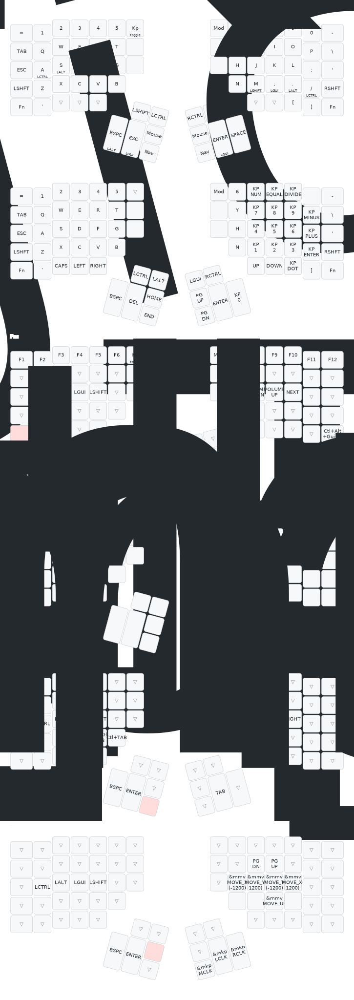

# adv360-zmk-config

<!-- START doctoc generated TOC please keep comment here to allow auto update -->
<!-- DON'T EDIT THIS SECTION, INSTEAD RE-RUN doctoc TO UPDATE -->
**Table of Contents**  *generated with [DocToc](https://github.com/thlorenz/doctoc)*

- [Description](#description)
- [Modifying the Keymap](#modifying-the-keymap)
- [Building the Firmware](#building-the-firmware)
  - [With GitHub Actions](#with-github-actions)
  - [With Local Container](#with-local-container)
    - [Setup](#setup)
      - [Software](#software)
      - [macOS specific](#macos-specific)
      - [Building the firmware](#building-the-firmware)
      - [Cleanup](#cleanup)
- [Flashing Firmware](#flashing-firmware)
- [Keymap Layout](#keymap-layout)

<!-- END doctoc generated TOC please keep comment here to allow auto update -->

## Description

This repository contains the configuration files required to build ZMK firmware for the Kinesis Advantage 360 Pro
ergonomic keyboard.

It is built based on the [Kinesis ZMK fork](https://github.com/KinesisCorporation/Adv360-Pro-ZMK), which provides
additional functionality specific to the Advantage 360 Pro.

## Modifying the Keymap

[The ZMK documentation](https://zmk.dev/docs) covers both basic and advanced functionality and has a table of OS
compatibility for keycodes. Please note that the RGB Underglow, Backlight and Power Management sections are not
relevant to the Advantage 360 Pro's custom ZMK fork.

Make the appropriate changes to the [config/adv360.keymap](config/adv360.keymap) file to modify the keymap.

Certain ZMK features (e.g. combos) require knowing the exact key positions in the matrix. They can be found in both
image and text format in the [key positions](assets/key-positions.md) file.

## Building the Firmware

### With GitHub Actions

1. Push a commit to trigger the build.
2. Download the artifact.

### With Local Container

#### Setup

##### Software

- Either Podman or Docker is required, Podman is chosen if both are installed.
- Make is also required

##### macOS specific

On macOS [brew](https://brew.sh) can be used to install the required components.

- docker
- [colima](https://github.com/abiosoft/colima) can be used as the docker engine

```shell
brew install docker colima
colima start
```

> Note: On Apple Silicon (ARM based) systems you need to make sure to start colima with the correct architecture for
the container being used.
>
> ```shell
> colima start --arch x86_64
> ```

##### Building the firmware

1. Execute `make` to build firmware for both halves or `make left` to only build firmware for the left hand side.
2. Check the `firmware` directory for the latest firmware build. The first part of the filename is the timestamp when
the firmware was built.

##### Cleanup

The built docker container and compiled firmware files can be deleted with `make clean`.

Creating the docker container takes some time. Therefore `make clean_firmware` can be used to only clean firmware
without removing the docker container. Similarly `make clean_image` can be used to remove the docker container without
removing compiled firmware files.

## Flashing Firmware

Follow the programming instruction on page 8 of the [Quick Start Guide](https://kinesis-ergo.com/wp-content/uploads/Advantage360-Professional-QSG-v8-25-22.pdf)
to flash the firmware.

1. Extract the firmwares from the archive downloaded from the GitHub build job (If using the cloud builder) or the
firmware folder (If building locally).
1. Connect the left side keyboard to USB.
1. Press Mod+macro1 to put the left side into bootloader mode; it should attach to your computer as a USB drive.
1. Copy `left.uf2` to the USB drive and it will disconnect.
1. Unplug the left side keyboard. You may choose to keep it on.
1. Connect the right side keyboard to USB.
1. Press Mod+macro3 to put the right side into bootloader mode to attach it as a USB drive.
1. Copy `right.uf2` to the mounted drive.
1. Unplug the right side keyboard.
1. Enjoy!

> Note: There are also physical reset buttons on both keyboards which can be used to enter and exit the bootloader
mode. Their location is described in section 2.7 on page 9 in the [User Manual](https://kinesis-ergo.com/wp-content/uploads/Advantage360-ZMK-KB360-PRO-Users-Manual-v3-10-23.pdf)
and use is described in section 5.9 on page 14.
>
> Note: Some operating systems wont always treat the drive as ejected after the settings-reset file is flashed or may
throw a spurious error, this doesn't mean that the flashing process has failed.

## Keymap Layout



Created with `task build-keymap`.
